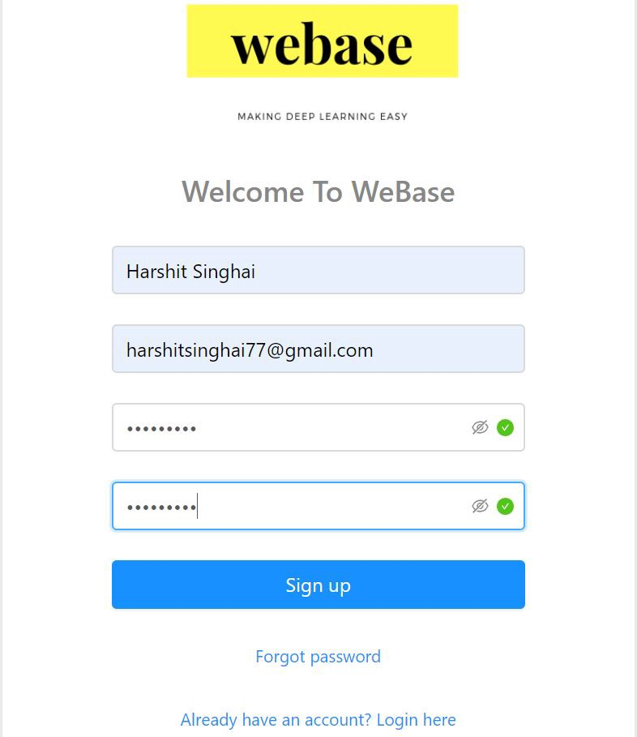
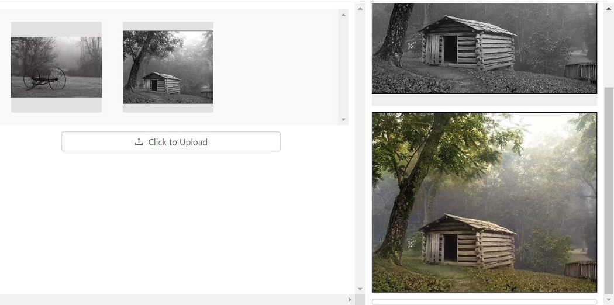
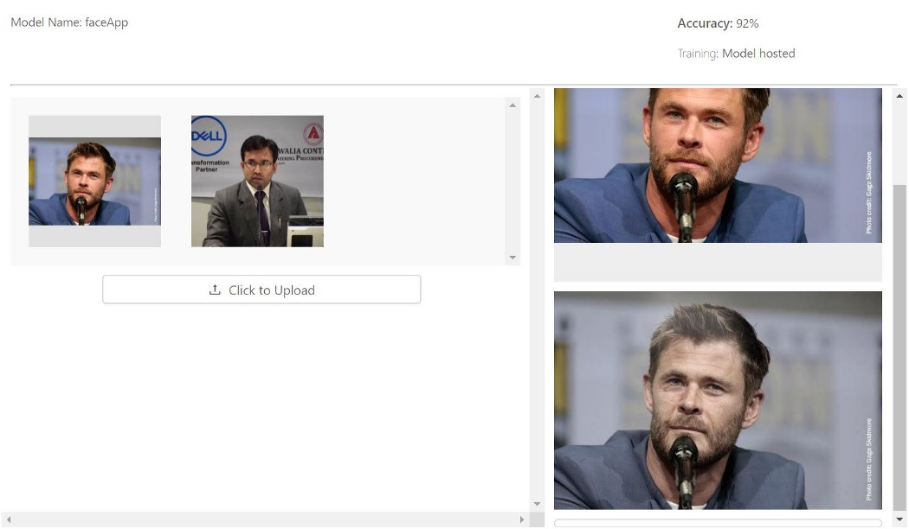
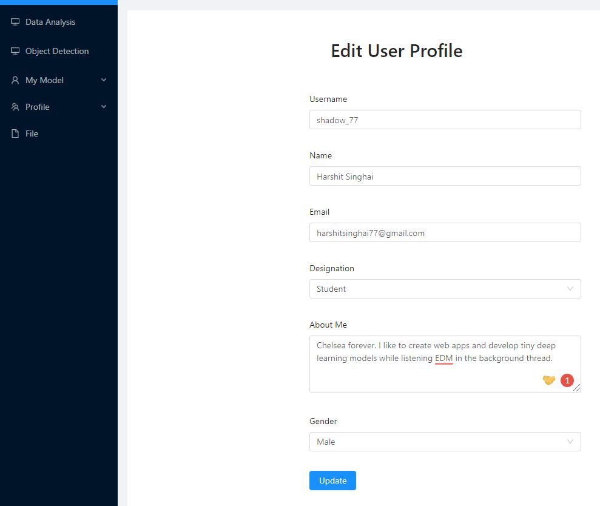

# WeBase
WeBase aims to make advanced AI accessible for users with it’s simple to use interface.  
By making the machine learning algorithm accessible via a simple API call or a web application, we can significantly reduce the time and effort. Thus enabling better use of manpower and work hours. WeBase provides common machine learning models as a service to make advance AI accessible for developers. Our simple to use user-interface allows users to use our pre-trained machine learning models with ease.

## Landing Page
https://webaseai.netlify.app/

## Live Demo
https://app-webase.netlify.app/ 
 
 
### **Test Credentials**  
**Email** - harshitsinghai77@gmail.com  
**Password** - Pass@12345

## Medium
https://medium.com/@harshitsinghai77/introducing-webase-3f765076c403

## Youtube
https://www.youtube.com/watch?v=buU5tFiB_qQ

## Screenshots of Web App

